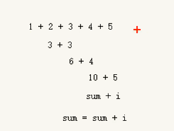
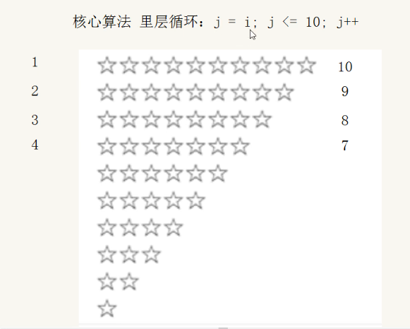
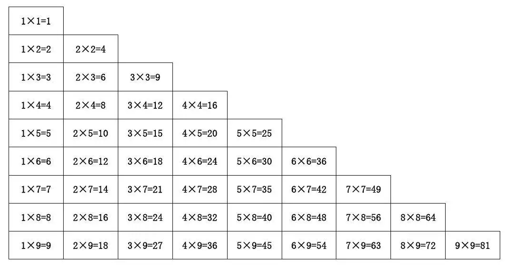
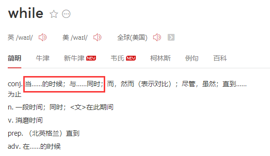
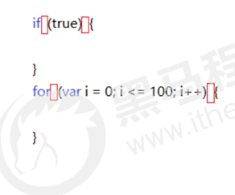

## 1  循环

#### Target

1. 能够使用循环语句重复执行一段代码
2. 能够说出break和continue关键字的作用
3. 能够使用断点调试代码
4. 能够说出双重for循环的执行过程
5. 能够写出九九乘法表案例
6. 能够说出while do while 和for循环的区别

### 1.1 循环的目的

在实际问题中，有许多具有<span style="color: red">**规律性的重复操作**</span>，因此在程序中要完成这类操作就需要<span style="color:red">**重复执行某些语句**</span>。

**Js 中的主要有三中类型的循环语句：**

- <span style="color:red;">**for 循环** </span>
- while 循环
- do...while 循环

循环目的: 	**可以重复执行某些代码语句**


### 1.2 for循环

#### 1.2.1 语法结构

for 循环主要用于<span style="color:red;">**把某些代码循环若干次**</span>，通常跟<span style="color:red;">**计数**</span>有关系。其语法结构如下：

```js
for(初始化变量; 条件表达式; 操作表达式 ){
    //循环体
}
```

在程序中，<span style="color:red">**一组被重复执行的语句**</span>被称之为<span style="color:red">**循环体**</span>，能否继续重复执行，取决于循环的<span style="color:red;">**终止条件**</span>。由循环体

及循环的终止条件组成的语句，被称之为<span style="color: red;">**循环语句**</span>


| 名称       | 作用                                                         |
| ---------- | ------------------------------------------------------------ |
| 初始化变量 | 通常被用于<span style="color:red;">**初始化一个计数器**</span>，该表达式可以使用 var 关键字声明新的变量，<br />这个变量帮我们来**记录次数**。 |
| 条件表达式 | 用于<span style="color:red;">**确定每一次循环是否能被执行**</span>。如果结果是 true 就继续循环，否则退出循环。 |
| 操作表达式 | 每次循环的最后都要执行的表达式。通常被用于<span style="color:red;">**更新或者递增计数器变量**</span>。当然，递减变量也是可以的 |


### 1.2.2 执行过程

1. 初始化变量，**初始化操作在整个 for 循环只会执行一次。**
2. 执行条件表达式，如果为true，则执行循环体语句，否则退出循环，循环结束。
3. 执行操作表达式，此时第一轮结束。
4. 第二轮开始，直接去执行条件表达式（不再初始化变量），如果为 true ，则去执行循环体语句，否则退出循环。
5. 继续执行操作表达式，第二轮结束。
6. 后续跟第二轮一致，直至条件表达式为假，结束整个 for 循环。


**CODE01/02**

```js
 for (var i = 1; i <= 100; i++) {  
    console.log('你好吗');//循环体
    // i 的理解： i称之为计数器
    // for循环是要循环多次，要确定循环几次，就需要有一个计数器
    // 循环一次，i就需要加1
}
    /*1. 初始化：var i = 1 
    初始化变量，初始化只执行一次。 （如果执行多次，死循环）
    2. 条件：i <= 100 
    i的值一旦变化，就要判断 条件表达式：i <= 100 是否成立
    3. 循环体
    条件表达式一旦成立，就会执行循环体。 否则，不执行。
    4. 操作表达式：i++
    最后执行 操作表达式：i++，因为i如果不变化，那么永远为1，就为死循环了。
    操作表达式执行完，i又变化了，所以再执行第二步。

	步骤：
    1,2,3,4
    2,3,4
    2,3,4*/
    //小任务，自己写for循环执行流程，换成自己的话语写出for循环执行流程
```


### 1.2.3 断点调试

注：*通过sources断点可以监视变量的值的变化，非常的常用**。*

**描述：**断点调试是**指自己在程序的某一行设置一个断点**，调试时，程序运行到这一行就会停住，然后你可以一步一步往下调试，调试过程中可以**看各个变量当前的值**，出错的话，调试到出错的代码行即显示错误，停下。

**目的：**断点调试可以**帮助观察程序的运行过程，** **然后发现bug，解决bug**。

**操作：**

- 浏览器中按 F12--> sources -->找到需要调试的文件-->在程序的某一行设置断点
- F11： 程序单步执行，让程序一步一步的执行，这个时候，可以观察watch中变量的值的变化。

**断点调试步骤**：

1. 打断点  （js代码第一行）
2. 刷新，运行程序
3. 观察变量
4. 发现问题


### 1.2.4 for 循环重复相同代码

使用**计数器**，可以实现for循环重复不同的代码

**CODE03**

```js
//  1. 重复基本写法
for(var i = 1; i <= 10; i++){
    console.log('人生没有白走的路, 每一步都有意义');
}
// 2. 循环次数自己设置
var num = prompt('请输入次数:')；
for ( var i = 1 ; i <= num; i++) {
    console.log('every step counts')
} 
```

### 1.2.5 for循环重复不同的代码

for 循环还可以重复不同的代码，这主要是因为使用了计数器 ，计数器在每次循环过程中都会有变化。

```js
//  循环时输出不同的代码
for (var i = 1; i <= 100; i++) {
      console.log('这个人今年' + i + '岁了');
}
// 结合判断语句来循环不同的代码
for (var i = 1; i <= 100; i++) {
 	if (i == 1) {
    	console.log('这个人今年1岁了， 他出生了');
 	} else if (i == 18) {
    	console.log('这个人今年18岁了，他考上清华了');
  	} else if (i == 100){
        console.log('ta 挂了')
  	} else {
        console.log(`这个人今年${i}岁了`);
    }
}
```


**思考：**

​	通过循环能不能做数字的累加呢？尝试求1-100之间所有整数的累加和。

### 1.2.6 for循环重复某些操作

求1-100之间所有整数的累加和

**for循环书写步骤**

1. 确定初始值（一般都是从1，0开始）
2. 确定范围 
3. 循环体



求和公式 :  sum = sum + i;    ==>  sum += i; 

定义一个sum变量, 来存每次计算后的总和;

每次循环, 用上一次得到的和, 加上我们的变量i, 就得到当前循环后 的 总和 ;

**CODE04 - 求 1~100 之间的整数累加和**

```js
// 求 1~100 之间的整数累加和
// 需要循环100次，我们需要一个计数器  i  
// 我们需要一个存储结果的变量 sum ，但是初始值一定是 0
// 核心算法：1 + 2 + 3 + 4 ....   ，sum  =  sum + i;
var sum = 0;
for(var i = 1;i <= 100; i++){
	sum += i;
}
console.log('1-100之间整数的和 = ' + sum);

// 也可以反着写~
for(var i = 100;i >= 1; i--){
	sum += i;
}
```


### 1.2.6 for循环案例

#### 1.求1-100之间所有数的平均值

​		需要一个 sum 和的变量， 还需要一个变量average去接收平均值

**CODE05 - 求平均数**

```js
var sum = 0;
var average = 0;
for (var i = 1; i <= 100; i++) {
    sum = sum + i;
}
average = sum / 100;
console.log(average);
```

#### 2. 求1-100之间所有偶数和奇数的和

​		需要一个偶数的和变量 even  还需要一个奇数 odd

​		问题：如何取余？？

**CODE06 - 求偶数和奇数的和**

```js
var even = 0;
var odd = 0;
for (var i = 1; i <= 100; i++) {
    if (i % 2 == 0) {
        even = even + i;
    } else {
        odd = odd + i;
    }
}
console.log('1~100 之间所有的偶数和是' + even);
console.log('1~100 之间所有的奇数和是' + odd);
```

#### 3. 思考：如何求1-100之间所有能被3整除的数字的和

**CODE07**

```js
var result = 0;
for (var i = 1; i <= 100; i++) {
    if (i % 3 == 0) {
        // result = result + i;
        result += i;
    }
}
console.log('1~100之间能够被3整数的数字的和是：' + result);
```

#### 4.练习： 求学生成绩

> 1. 弹出输入框输入总的班级人数(num)
> 2. 依次输入学生的成绩（ 保存起来 score）， 此时我们需要用到 for 循环
> 3. 弹出的次数跟班级总人数有关系 条件表达式 i <= num
> 4. 进行业务处理: 计算成绩。 先求总成绩（ sum）， 之后求平均成绩（ average）

**CODE08**

```js
var num = prompt('请输入班级的总人数:'); // num 总的班级人数
var sum = 0; // 求和的变量
var average = 0; // 求平均值的变量
for (var i = 1; i <= num; i++) {
    var score = prompt('请您输入第' + i + '个学生成绩');
    // 因为从prompt取过来的数据是 字符串型的需要转换为数字型
    sum = sum + parseFloat(score);
}
average = sum / num;
alert('班级总的成绩是' + sum);
alert('班级平均分是：' + average);
```

#### 5.一行打印五科星星案例

**CODE09**

```JS
// 1. 一行打印五个星星 
 console.log('★★★★★');

// 2. 循环打印5个星星
 for (var i = 1; i <= 5; i++) {
     console.log('★');
 }

// 3. 星星依次增加
 var str = '';
 for (var i = 1; i <= 5; i++) {
     str = str + '★';
     console.log(str);
 }
 console.log(str);

// 4. 自定义确定星星数量
var num = prompt('请输入星星的个数');
var str = '';
for (var i = 1; i <= num; i++) {
str = str + '★'
}
console.log(str);
```

**思考：**如何做一个二维的星星矩形


## 1.3 双重for循环

> for循环都拿下了，双重循环也就那样呗

### 1.3.1 双重循环

> 一句话概括就是：循环里面放循环

#### 1. 双重 for 循环概述

- 循环嵌套是指在**一个循环语句中再定义一个循环语句的语法结构**
- 例如在for循环语句中，可以再嵌套一个for 循环，这样的 for 循环语句我们称之为双重for循环。
- 可不可以三重嵌套呢?  可以, 容易被锤~ 性能原因

#### 2. 双重for循环的语法

```js
for (外循环的初始; 外循环的条件; 外循环的操作表达式) {
    for (内循环的初始; 内循环的条件; 内循环的操作表达式) {  
       // 需执行的代码;
   }
}
```

- **内层循环可以看做外层循环的语句**
- 内层循环执行的顺序也要遵循 for 循环的执行顺序 
- **外层循环执行一次，内层循环要执行全部次数**


#### 3. 循环例子

```js
for (var i = 1; i <= 3; i++) {
    console.log('这是外层循环第' + i + '次');
    for (var j = 1; j <= 3; j++) {
        console.log('这是里层的循环第' + j + '次');

    }
}
```

### 1.3.2 双重循环案例

**1.案例：**打印五行五列星星

核心逻辑: 

- 外层循环 负责打印五行
- 内层循环 负责一行打印五个星星


**CODE10**

```js
// 打印五行五列星星
var str = '';
for (var i = 1; i <= 5; i++) { // 外层循环负责打印五行
    for (var j = 1; j <= 5; j++) { // 里层循环负责一行打印五个星星
        str = str + '★';
    }
    // 如果一行打印完毕5个星星就要另起一行 加 \n
    str = str + '\n';
}
console.log(str);

// 需求2:升级版 打印n行n列
// 打印n行n列的星星
var rows = prompt('请您输入行数:');
var cols = prompt('请您输入列数:');
var str = '';
for (var i = 1; i <= rows; i++) {
  for (var j = 1; j <= cols; j++) {
    str = str + '★';
  }
  str += '\n';
}
console.log(str);
```

**注意**：

- 内层循环控制列，外层循环控制行
- 外层循环与内层循环不能使用同一个计数器，**一般外使用i，内使用j**（程序员的习惯）


**2.思考：**如果想打印出带有梯度的呢？


思路分析:



**CODE11 - 倒三角**

- emoji

```js
var str = '';
for (var i = 1; i <= 10; i++) { // 外层循环控制行数
    for (var j = i; j <= 10; j++) { // 里层循环打印的个数不一样  j = i
        str = str + '★';  // str += '星星'
    }

    str += '\n';
}
console.log(str);
```


### 1.3.3 for循环经典案例 - 九九乘法表



> 一共有9行，但是每行的个数不一样，因此需要用到双重 for 循环
> 外层的 for 循环控制行数 i ，循环9次 ，可以打印 9 行  
> 内层的 for 循环控制每行公式  j  
> 核心算法：每一行 公式的个数正好和行数一致， j <= i;
>  每行打印完毕，都需要重新换一行

分析结论：

	1. 先想办法画一个正三角
	2. **列数等于行号：内层循环的条件：j<=i**
	
	2. 看图说话：从第二行开始看： 第二个乘数 正好是行号 ， 第一个乘数是列号

**CODE12**

```js
var str = '';
for (var i = 1; i <= 9; i++) { // 外层循环控制行数
    for (var j = 1; j <= i; j++) { // 里层循环控制每一行的个数  j <= i
        // 1 × 2 = 2
        // str = str + '★';
        str += j + '×' + i + '=' + i * j + '\t';
    }
    str += '\n';
}
console.log(str);
```

### 小结：

for 循环小结

- for 循环可以重复执行某些相同代码
- 通过计数器，for 循环可以重复执行些许不同的代码
- for 循环也可以重复执行某些数学操作，比如算术运算符加法操作
- 随着需求增加，双重for循环可以做更多的效果
- 双重 for 循环，外层循环一次，内层 for 循环全部执行（n ^ m）
- for 循环是循环条件和数字直接相关的循环


## 1.4 while 循环

### 1.4.1 while概述



​		while 语句可以在条件**表达式为真**的前提下，**循环执行**指定的一段代码，直到表达式不为真时结束循环

### 1.4.2 语法规范

**CODE13**

```js
while (条件表达式) {
    // 循环体代码 
}

var num = 1;
while (num <= 100) {
    console.log('how are u?');
    num++; // 敢不敢试试不写num++？
}
```

**执行思路**：

1. 先执行条件表达式，如果结果为 true，则执行循环体代码；如果为 false，则退出循环，执行后面代码

2. 执行循环体代码

3. 循环体代码执行完毕后，程序会继续判断执行条件表达式，如条件仍为true，则会继续执行循环体，直到循环条件为 false 时，整个循环过程才会结束

**注意**：

1. 使用 while 循环时一定要注意，它**必须要有退出条件，否则会成为死循环**（浏览器会卡死的哟~~）
2. while 循环和 for 循环的不同之处在于 **while 循环可以做较为复杂的条件判断（是否确定循环次数）**

### 1.4.3 while 循环案例

**1.打印人的一生，从1岁到100岁**

> 条件表达式需要让变量小于等于100
>
> 每次循环变量需要自增

**CODE14**

```JS
var i = 1;
while (i <= 100) {
    console.log('这个人今年' + i + '岁了');
    i++;
}
```

**2.计算 1 ~ 100 之间所有整数的和**

**CODE15**

> 思考和for循环时的1~100累加有什么区别

```JS
var sum = 0;
var j = 1;
while (j <= 100) {
    sum += j;
    j++
}
console.log(sum);
```

**3.弹出一个提示框， 你爱我吗？  如果输入我爱你，就提示结束，否则，一直询问**

> 思考需要满足什么条件时才能进入循环

这个时候for循环就不适合了，for循环适合变量有数量增减的情况。

**CODE16**

```JS
var msg = prompt('你爱我吗?');
while (msg !== '我爱你') {
    msg = prompt('你爱我吗?');
}
alert('我也爱你啊！');
```

## 1.5 do-while循环（了解不常用）

### 1.5.1 do-while概述

1. **do... while 语句其实是 while 语句的一个变体。**

2. 该循环会**先执行一次代码块**，然后对条件表达式进行判断，如果条件为真，就会重复执行循环体，否则退出循环。

### 1.5.2 语法规范

```js
do {
    // 循环体代码 - 条件表达式为 true 时重复执行循环体代码
} while(条件表达式);

var i = 1;
do {
    console.log('how are you?');
    i++;
} while (i <= 100)
```

**执行思路**：

1. 先执行一次循环体代码 
2. 再执行条件表达式，如果结果为 true，则继续执行循环体代码，如果为 false，则退出循环，继续执行后面代码	
3. **注意**：**先再执行循环体，再判断**，do…while循环语句**至少会执行一次循环体代码**

### 1.5.3 do-while 循环案例

**1.打印人的一生，从1岁到100岁**

**CODE14**

```JS
var i = 1;
do {
    console.log('这个人今年' + i + '岁了');
    i++;
} while (i <= 100)
```

**2.计算 1 ~ 100 之间所有整数的和**

**CODE15**

```JS
var sum = 0;
var j = 1;
do {
    sum += j;
    j++;
} while (j <= 100)
console.log(sum);
```

**3.弹出一个提示框， 你爱我吗？  如果输入我爱你，就提示结束，否则，一直询问**

**CODE16**

```JS
do {
	var message = prompt('你爱我吗?');
} while (message !== '我爱你')
alert('我也爱你啊');
```

## 1.6  continue、break

### 1.6.1 continue关键字

> 继续下次循环，跳过本次循环

<span style="color:red;">**continue 关键字**</span>用于立即<span style="color:red">**跳出本次循环**，**继续下一次循环**</span>（本次循环体中 continue 之后的代码就会少执行

一次）。


例如，吃5个包子，第3个有虫子，就扔掉第3个，继续吃第4个第5个包子，其代码实现如下：

**CODE17**

```js
 for (var i = 1; i <= 5; i++) {
     if (i == 3) {
         console.log('这个包子有虫子，扔掉');
         continue; // 跳出本次循环，跳出的是第3次循环 
      }
      console.log('我正在吃第' + i + '个包子呢');
 }
```

运行结果：


**思考题：**求1~100之间， 除了能被7整除之外的整数和

> 通过条件判断出哪些数字能被7整除
>
> 然后再累加求和

**CODE18**

```js
var sum = 0;
for (var i = 1; i <= 100; i++) {
    if (i % 7 == 0) {
   		continue;
// 当我们在满足某些条件后希望不再执行当次循环的后续逻辑时，可以使用continue
    }
	sum += i;
}
console.log(sum);

// **注意**：这里使用continue有点为了用而用，其实上述需求，可以使用更简单的代码实现，或者说正常的思路
var sum = 0;
for (var i = 1; i <= 100; i++) {
    if (i % 7 != 0) {
    	sum += i;
    }
}
console.log(sum);
```


> 当我们在满足某些条件后希望不再执行当次循环的后续逻辑时，可以使用continue

### 1.6.2 break关键字

> 立即跳出当前整个循环

break 关键字**用于立即跳出当前整个循环**（循环结束）。


**CODE19**

  例如，吃5个包子，吃到第3个发现里面有半个虫子，其余的不吃了，其代码实现如下：

```js
for (var i = 1; i <= 5; i++) {
   if (i == 3) {
       break; // 直接退出整个for 循环，跳到整个for下面的语句
   }
   console.log('我正在吃第' + i + '个包子呢');
 }
```


## 1.7 循环总结

如何选择循环语句？

1. 确定循环次数

   for:  循环条件一般是一个范围  

2. 不确定循环次数 或 循环条件可以比较复杂

   while：  先判断，再做
   do-while：先做，再判断（先执行一次，才知道是否要开始循环）

3. 大部分情况用的都是for; 而while也可以结合break使用

**CODE20**

```JS
//while循环配合break
while (true) {
    // 如果满足某个条件，跳出
    break;
}

//while
while (true) {
    var message = prompt('你爱我吗?');
    if (message == '我爱你') {
        // 如果满足某个条件，跳出
        break;
    }
}
```

# 2.  代码规范

### 2.1 标识符命名规范

-  变量、函数的命名必须要有意义
-  变量的名称一般用名词  
-  函数的名称一般用动词

### 2.2 循环操作符规范

```js
// 操作符的左右两侧各保留一个空格
for (var i = 1; i <= 5; i++) {
   if (i == 3) {
       break; // 直接退出整个 for 循环，跳到整个for循环下面的语句
   }
   console.log('我正在吃第' + i + '个包子呢');
}
```

### 2.3 单行注释

```js
for (var i = 1; i <= 5; i++) {
   if (i == 3) {
       break; // 单行注释前面注意有个空格 (推荐)
   }
   console.log('我正在吃第' + i + '个包子呢');
}
```

### 2.4 其他规范	

关键词、操作符之间后加空格



