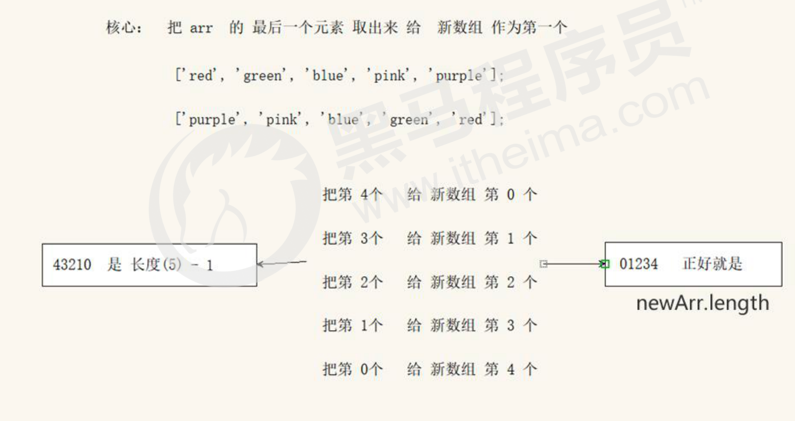
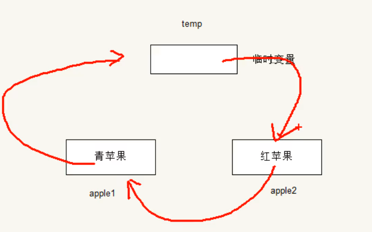
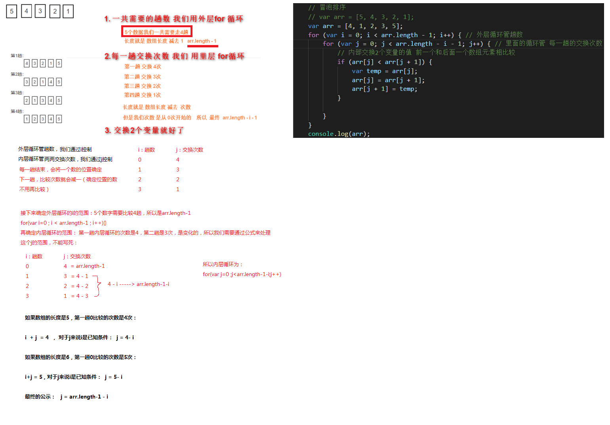

#### Target

1. 能够说出数组的作用
2. 能够通过索引获取或设置数组中的数据
3. 能够通过for循环遍历数组中的数据并打印
4. 能够求出一组数组中的最大值
5. 能够说出冒泡排序的实现思路
6. 能够说出函数的形参和实参的区别
7. 能够使用函数封装一段代码重复使用
8. 能够说出函数中return的作用

## 1  数组

### 1.1 需求场景

```javascript
  // 如果我们想存储班级中所有学生（56个人）的姓名，那么该如何存储呢？
  // 用之前所学的保存变量的方式
  // 思路1:
  //   var student = '张三';
  //       student = '张三1';
  //       ......
  //       student = '张三56' // 变量被覆盖

  // 思路2:
  //    var student1 = '张三1'
  //    var student2 = '张三2'
  //     .....
  //    var student56 = '张三56' // 不断的开辟内存空间 浪费内存


  // 可以使用数组(Array)。数组可以把一组相关的数据一起存放，并提供方便的访问(获取）方式；

  var arr = ['张三', '张三1', '张三2', '张三3', '张三4', '张三5', '张三6', '张三56']
  console.log(arr);
```


### 1.2 数组的概念

> 数组：使用单独的变量来存储一组数据集合


数组是指<span style="color:red;">**一组数据的集合**</span>，其中的每一个数据被称作<span style="color:red;">**元素**</span>，在数组中可以<span style="color:red;">**存放任意类型的元素**</span>。

```javascript
// 普通变量一次只能存储一个值
var num = 10; 

// 数组一次可以存储多个值
var arr = [1,2,3,4,5];
```

**作用**：数组可以把<span style="color:red">一组相关的数据一起存放（存储在单个变量名下），并提供方便的访问(获取）方式</span>。

**特点：**

1. 在数组中可以**存放任意类型的元素**

   *注意：我们通常会把**一组相关的，并且数据类型相同的数据一起存放***

2. **数组的理解**：使用单独的变量来存储一组数据集合


### 1.3 创建数组

**JS 中创建数组有两种方式：**1. 利用  new 创建数组   2. 利用数组字面量创建数组

#### 1.3.1 利用 new 创建数组

**CODE01**

```javascript
var 数组名 = new Array() ；
var arr = new Array();   // 创建一个新的空数组
```

> 注意<span style="color:red;"> **Array () ，A 要大写**    </span>

#### 1.3.2 利用数组字面量创建数组 

**CODE01**

```javascript
//1. 使用数组字面量方式创建空的数组 []
var  数组名 = []；
//2. 使用数组字面量方式创建带初始值的数组
var  数组名 = ['小白','小黑','大黄','瑞奇'];
```

- 数组的字面量是<span style="color:red;">**方括号 [ ]** </span>
- **声明数组并赋值称**为数组的<span style="color:red;">初始化</span>
- 这种<span  style="color:red;">**字面量方式**</span>也是我们以后最多使用的方式

#### 1.3.3 数组元素的类型

数组中可以存放<span style="color: red;">**任意类型**</span>的数据，例如字符串，数字，布尔值等。

```javascript
var arrStus = ['小白',12,true,28.9];
```


思考：

1. 数组的作用是什么？
   1. 将一组相关的数据集合存储在一个变量名下，并提供方便的访问（获取）元素的方式
2. 创建数组有那两种方式，哪一种最常用？
   1. new, 字面量  ；  字面量更常用
3. 数组元素的类型有限制吗？
   1. 数组中可以存放任意类型的元素， 如字符串，数字，布尔值等
   2. 一般会存放一类相同数据类型的元素，最终根据需求来决定


### 1.4 获取数组中的元素

**索引 (下标)** ：<span style="color:red">**用来访问数组元素的序号**（数组下标从 0 开始）</span>。


**特点：**

1. 数组可以通过<span style="color:red;">**索引**</span>来访问、设置、修改对应的数组元素，

2. 可以通过<span style="color:red;">**数组名[索引]**</span>的形式来获取数组中的元素。

**CODE02**

```js
// 定义数组
var arrStus = [1,2,3];
// 获取数组中的第2个元素
alert(arrStus[1]);
```

注意：如果访问时<span style="color:red;">**数组没有和索引值对应的元素**</span>，则得到的值是undefined


**练习：**给一个星期几的数组，使用数组索引找到其中包含的休息日

```js
var week = ["星期日", "星期一","星期二","星期三","星期四","星期五","星期六"];
```


### 1.5 遍历数组

Q: 数组中的每一项元素我们怎么取出来？

- 通过 "数组名[索引号]"的方式一项一项取出来

Q:  怎么把数组里面的元素全部取出来？

- 循环遍历~，索引从0开始。

#### 1.5.1 **遍历**

数组遍历: <span style="color:red;">**把数组中的每个元素从头到尾都访问（获取）一次**</span>（类似学生的点名）。

可以通过 for 循环索引遍历数组中的每一项

**CODE03**

```js
var arr = ['red','green', 'blue','pink'];
for(var i = 0; i < arr.length; i++){
    // 注意：i从0开始(只要是遍历数组，一般都是从0开始)
    console.log(arr[i]);
}
```

*<font color='red'>注意:</font>数组的索引号从0开始！！！*


**练习：**把自己的爱好写成一个数组，然后通过控制台将数组中所有的值都打印出来


#### 1.5.2. 数组的长度

数组的长度：默认情况下<span style="color:red;">**表示数组中元素的个数**</span>

使用**<span style="color:red;">数组名.length</span>**可以访问数组元素的数量（数组长度）。

```js
var arrStus = [1,2,3];
alert(arrStus.length );  // 3
arrStus.length - 1 
```

  **注意**：

- 此处<span style="color:red;">**数组的长度是数组元素的个数**</span> ，不要和数组的索引号混淆。
- 当我们数组里面的<span style="color:red;">**元素个数发生了变化**</span>，这个 <span style="color:red;">**length 属性**</span>跟着一起变化

#### 1.5.3 遍历数组的固定写法

**CODE04**

```js
for (var i = 0; i < arr.length; i++) {
	console.log(arr[i]);
}

for (var i = 0; i <= arr.length - 1; i++) {
	console.log(arr[i]);
}
```


#### 1.5.4 遍历部分小结

1. 什么是遍历 ？  把数组中的每个元素从头到尾都访问一次
2. 我们通过什么来遍历数组里面的元素？ For 循环
3. for 里面的 i 是什么？当什么使用？ for里面的数组元素怎么写？<span style="color:red;">**i是计数器，当索引号使用， arr[i] 是数组元素 第i个数组元素**</span> (第0个开始数)
4. 怎么获取数组的长度？length 属性
5. 数组索引号和数组长度有什么关系？<span  style="color:red;">**索引号从0开始， 数组长度是 元素个数**</span>


#### 1.5.5 遍历案列练习

##### - 1 求数组求和及平均值

**CODE04**

```javascript
// 1. 求数组 [2,6,1,7, 4] 里面所有元素的和以及平均值。
// (1)声明一个求和变量 sum。
// (2)遍历这个数组，把里面每个数组元素加到 sum 里面。
// (3)用求和变量 sum 除以数组的长度就可以得到数组的平均值。
var arr = [2, 6, 1, 7, 4];
var sum = 0;
var average = 0;
for (var i = 0; i < arr.length; i++) {
  sum += arr[i]; // 我们加的是数组元素 arr[i] 不是计数器 i
}
average = sum / arr.length;
console.log(sum, average); // 想要输出多个变量，用逗号分隔即可
```

##### - 2 求数组最大值

**CODE05**

```javascript
// 求数组[2,6,1,77,52,25,7]中的最大值
// 声明一个保存最大元素的变量 max。
// 默认最大值可以取数组中的第一个元素。
// 遍历这个数组，把里面每个数组元素和 max 相比较。
// 如果这个数组元素大于max 就把这个数组元素存到 max 里面，否则继续下一轮比较。
// 最后输出这个 max

var arr = [2, 6, 1, 77, 52, 25, 7, 99];
var max = arr[0];
for (var i = 1; i < arr.length; i++) {
  if (arr[i] > max) {
    max = arr[i];
  }
}
console.log('该数组里面的最大值是：' + max);
```

##### - 3 将数组转换为字符串

**CODE06**

```javascript
// 将数组 ['red', 'green', 'blue', 'pink'] 转换为字符串，并且用 | 或其他符号分割
// 1.需要一个新变量用于存放转换完的字符串 str。
// 2.遍历原来的数组，分别把里面数据取出来，加到字符串里面。
// 3.同时在后面多加一个分隔符
var arr = ['red', 'green', 'blue', 'pink'];
var str = '';
var sep = '*'; // | 
for (var i = 0; i < arr.length; i++) {
  str += arr[i] + sep;
}
console.log(str);
```


### 1.6  数组中新增元素

##### 1.6.1 修改 length 长度新增数组元素

- 可以通过修改 length 长度来实现数组扩容的目的
- length 属性是可读写的

**CODE07**

```javascript
var arr = ['red', 'green', 'blue'];
console.log(arr.length);
arr.length = 1; // 把我们数组的长度修改为了 5  里面应该有5个元素 
console.log(arr);
console.log(arr[3]); // undefined
console.log(arr[4]); // undefined
```

>如果设置的<span style="color:red;">**length属性值大于数组的元素个数**</span>，则会在数组末尾出现empty元素, 值为undefined；
>
>如果设置的<span style="color:red;">**length属性值小于数组的元素个数**</span>，则会把超过该值的数组元素删除;

##### 1.6.2 **通过修改数组索引新增数组元素**

- 可以通过修改数组索引的方式追加数组元素
- 不能直接给数组名赋值，否则会覆盖掉以前的数据

**CODE07**

```javascript
// 2. 新增数组元素 修改索引号 追加数组元素
var arr1= ['red', 'green', 'blue'];
arr1[3] = 'pink';
console.log(arr1);
arr1[4] = 'hotpink';
console.log(arr1);
arr1[0] = 'yellow'; // 这里是替换原来的数组元素
console.log(arr1);
arr1 = '有点意思';
console.log(arr1); // 不要直接给 数组名赋值 否则里面的数组元素都没有了
```

### 1.7 综合案例

#### 1.7.1  数组存放1~10个值

**CODE08**

```javascript
// 新建一个数组，里面存放10个整数（ 1~10）， 要求使用循环追加的方式输出： [1,2,3,4,5,6,7,8,9,10]

// 核心原理：使用循环来追加数组。
// 1、声明一个空数组 arr。
// 2、循环中的计数器 i  可以作为数组元素存入。
// 3、由于数组的索引号是从0开始的， 因此计数器从 0 开始更合适，存入的数组元素要+1。
var arr = [];
for (var i = 0; i < 100; i++) {
  // arr = i; 不要直接给数组名赋值 否则以前的元素都没了
  arr[i] = i + 1;
}
console.log(arr);
```

#### 1.7.2 筛选数组 方法1

**CODE09**

```javascript
  // 将数组 [2, 0, 6, 1, 77, 0, 52, 0, 25, 7] 中大于等于 10 的元素选出来，放入新数组。
  // 1、声明一个新的数组用于存放新数据newArr。
  // 2、遍历原来的旧数组， 找出大于等于 10 的元素。
  // 3、依次追加给新数组 newArr。
  // 方法1
  var arr = [2, 0, 6, 1, 77, 0, 52, 0, 25, 7];
  var newArr = [];
  var j = 0;
  for (var i = 0; i < arr.length; i++) {
    if (arr[i] >= 10) {
      // 新数组索引号应该从0开始 依次递增
      newArr[j] = arr[i];
      j++;
    }
  }
  console.log(newArr);
```

#### 1.7.3 筛选数组方法2

**CODE09**

```js
var arr = [2, 0, 6, 1, 77, 0, 52, 0, 25, 7];
var newArr = [];
// 刚开始 newArr.length 就是 0
for (var i = 0; i < arr.length; i++) {
    if (arr[i] >= 10) {
        // 新数组索引号应该从0开始 依次递增
        newArr[newArr.length] = arr[i];// 给数组连续追加元素的固定写法 ***
    }
}
console.log(newArr);
```

**总结：**

- 此题重点，大家需要学会通过arr[arr.length]=新元素，来动态给数组添加元素。（连续追加元素）
- length总比数组中最大索引大1  ，那么arr.length就可以当做这个数组的新索引


> 给数组的尾部添加新元素的方法：<span style="color:red;">**数组[ 数组.length ] = 新数据;** </span> 

#### 1.7.4 删除数组指定元素

**CODE10**

```javascript
// 将数组[2, 0, 6, 1, 77, 0, 52, 0, 25, 7]中的 0 去掉后，形成一个不包含 0 的新数组。
  // 1、需要一个新数组用于存放筛选之后的数据。
  // 2、遍历原来的数组， 把不是 0 的数据添加到新数组里面(此时要注意采用数组名 + 索引的格式接收数据)。
  // 3、新数组里面的个数， 用 length 不断累加。
var arr = [2, 0, 6, 1, 77, 0, 52, 0, 25, 7, 2, 1, 52];
var newArr = [];
for (var i = 0; i < arr.length; i++) {
    if (arr[i] != 0) {
        newArr[newArr.length] = arr[i];
    }
}
console.log(newArr);
```

#### 1.7.5 翻转数组

**反转数组的思路**



```javascript
// 将数组 ['red', 'green', 'blue', 'pink', 'purple'] 的内容反过来存放
// 1、声明一个新数组 newArr
// 2、把旧数组索引号第4个取过来（arr.length - 1)，给新数组索引号第0个元素 (newArr.length)
// 3、我们采取 递减的方式  i--
var arr = ['red', 'green', 'blue', 'pink', 'purple'];
var newArr = [];
for (var i = arr.length - 1; i >= 0; i--) {
    newArr[newArr.length] = arr[i]
}
console.log(newArr);
```

**PS. 实际开发** : **arr.reverse()** : 注意该方法会改变原数组。

#### 1.7.6 复习交换两个变量值



```js
// 交换两个变量
var str1 = 'apple';
var str2 = 'Android';
var temp;
temp = str1;
str1 = str2;
str2 = temp;
console.log(str1, str2);
```


#### 1.7.7 16-冒泡排序( 面试笔试！)

**冒泡排序：**是一种算法，把一系列的数据按照一定的顺序进行排列显示(**从小到大或从大到小**）。


核心原理：一次比较两个元素，如果顺序错误，就把他们交换。

将一个数组[5,3,2,6,4,1]从小到大的排序

分析图



**CODE13**

```javascript
// 冒泡排序
var arr = [4, 1, 2, 3, 5];
for (var i = 0; i <= arr.length - 1; i++) { // 外层循环管趟数 
  for (var j = 0; j <= arr.length - i - 1; j++) { // 里面的循环管 每一趟的交换次数
    // 内部交换2个变量的值 前一个和后面一个数组元素相比较
    if (arr[j] < arr[j + 1]) {
      var temp = arr[j];
      arr[j] = arr[j + 1];
      arr[j + 1] = temp;
    }
  }
}
console.log(arr);
```


## 2 - 函数

#### Target

1. 能够说出函数的形参和实参的区别
2. 能够使用函数封装一段代码重复使用
3. 能够说出函数中return的作用

### 2.1 函数的概念

在 JS 里面，可能会定义非常多的相同代码或者功能相似的代码，这些代码可能需要大量重复使用。

虽然 for循环语句也能实现一些简单的重复操作，但是比较具有局限性，此时我们就可以使用 JS 中的函数。


**函数：**就是**封装了一段可被重复调用执行的代码块**。通过此代码块可以**实现大量代码的重复使用** 

**方法：**实现某一功能的函数

**注意：函数就是方法，都可以理解为一个工具。**

**CODE14**

```js
// 1. 求 1~100的累加和
var sum = 0;
for (var i = 1; i <= 100; i++) {
    sum += i;
}
console.log(sum);

// 2. 求 10~50的累加和
var sum = 0;
for (var i = 10; i <= 50; i++) {
    sum += i;
}
console.log(sum);

// 3. 函数就是封装了一段可以被重复执行调用的代码块 目的： 就是让大量代码重复使用
function getSum (num1, num2) {
    var sum = 0;
    for (var i = num1; i <= num2; i++) {
        sum += i;
    }
    console.log(sum);
}
getSum(1, 100);
getSum(10, 50);
getSum(1, 1000);
```


### 2.2 函数的使用

**函数使用分成两步：**

- <span style="color:red;">**声明函数**</span>
- 调用函数

#### 2.2.1 声明函数

```js
// 语法规范
// 声明函数
function 函数名() {
    //函数体代码
}
```

- <span style="color: red;">**function**</span> 是声明函数的关键字,<span style="color: red;">**必须小写**</span>

- 由于函数一般是<span style="color: red;">**为了实现某个功能**</span>才定义的， 所以通常我们对 <span style="color:red;">**函数名**</span> 命名为<span style="color:red;">动词</span>，比如 getSum（求和函数）

- 声明后，函数内部代码不会执行！！！

```js
function sayHi () {
    console.log('hi~~');
}
```

#### 2.2.2 调用函数

```js
// 调用函数
函数名();  // 通过调用函数名来执行函数体代码
```

- 调用的时候千万<span style="color:red;">不要忘记添加小括号</span>

- 口诀：函数不调用，自己不执行


> 注意：<span style="color: red;">**声明函数本身并不会执行代码，只有调用函数时才会执行函数体代码**</span>


```js
function sayHi () {
    console.log('hi~~');
}
sayHi(); // 浏览器console.log中
```

#### 2.2.3 函数的封装

- 函数的封装是<span style="color:red;">**把一个或者多个功能通过函数的方式封**</span>装起来，对外只提供一个简单的函数接口

- 简单理解：封装类似于将  <span style="color:red;"> **电脑配件整合组装**  </span> 到机箱中 ( 类似快递打包）  

  

**再理解**：函数将功能封装好，调用者不用关心里边是如何实现的，只管使用。


#### 2.2.4 封装计算1-100累加和

**CODE16**

```javascript
// 计算1-100之间值的函数
// 声明函数
function getSum(){
  var sumNum = 0;// 准备一个变量，保存数字和
  for (var i = 1; i <= 100; i++) {
    sumNum += i;// 把每个数值 都累加 到变量中
  }
  alert(sumNum);
}
// 调用函数
getSum();
```

#### 2.2.5 Question

- 函数是做什么的（作用）？函数就是封装了一段可重复执行的代码，通过函数可以提高代码的利用率。
- 声明函数用什么关键词？ function
- 如何调用函数？ 函数名()
- 封装是什么意思？就是把一个或者多个功能组合在一个函数里


### 2.3 函数的参数

#### 2.3.1 函数参数语法

<span style="color:red;">**在声明函数时**</span>，可以在函数名称后面的<span style="color:red;">小括号中添加一些参数</span>，这些参数被称为<span style="color:red;">**形参(形式上的参数)**</span>，而在<span style="color:red;">**调用该函数**</span>时，同样也需要传递相应的参数，这些参数被称为<span style="color:red;">实参</span>。

- 形参：<span style="color: red;">**函数定义时设置的未知参数**</span>

- 实参：<span style="color:red;">**函数调用时传入小括号内的真实数据**</span>

  

  


语法：

```js
// 带参数的函数声明
function 函数名 (形参1, 形参2 , 形参3...) { // 可以定义任意多的参数，用逗号分隔
  // 函数体
}
// 带参数的函数调用
函数名(实参1, 实参2, 实参3...); 
```

1. 调用的时候实参值会传递给形参
2. 形参简单理解为：不用声明的变量
3. 实参和形参的多个参数之间用逗号（,）分隔


<span style="color:red;">**参数的作用** </span>: 在函数内部某些值不能固定，我们可以通过参数在调用函数时传递不同的值进去。

怎么理解参数的作用呢： 让函数功能更加强大，更加灵活

##### - 案例 

**CODE17** 

求任意两个数的和

```js
// 利用函数求任意两个数的和
function getSum (num1, num2) {
    console.log(num1 + num2);
}
getSum(1, 3);
getSum(3, 8);
```

利用函数求任意两个数之间的和

```js
// 利用函数求任意两个数之间的和
function getSums (start, end) {
    var sum = 0;
    for (var i = start; i <= end; i++) {
        sum += i;
    }
    console.log(sum);
}
getSums(1, 100);
getSums(1, 10);
// 3. 注意点
// (1) 多个参数之间用逗号隔开
// (2) 形参可以看做是不用声明的变量
```

**总结：**分析题目中的不确定因素，**每一个不确定因素都是一个形参**


#### 2.3.2 函数形参和实参数量不匹配时(了解)


	注意：在JavaScript中，形参的默认值是undefined。

小结：

-  函数可以带参数也可以不带参数
-  声明函数的时候，函数名括号里面的是形参，形参的默认值为 undefined
-  调用函数的时候，函数名括号里面的是实参
-  多个参数中间用逗号分隔
-  形参的个数可以和实参个数不匹配，但是结果不可预计，我们尽量要匹配

```js
// 函数形参实参个数匹配
function getSum(num1, num2) {
    console.log(num1 + num2);
}
// 1. 如果实参的个数和形参的个数一致 则正常输出结果
getSum(1, 2);
// 2. 如果实参的个数多于形参的个数  会取到形参的个数 
getSum(1, 2, 3);
// 3. 如果实参的个数小于形参的个数  多于的形参定义为undefined  最终的结果就是 NaN
// 形参可以看做是不用声明的变量  num2 是一个变量但是没有接受值  结果就是undefined 
getSum(1); // NaN
// 建议 我们尽量让实参的个数和形参相匹配
```


### 2.4 函数的返回值

#### 2.4.1 return 语句

**概念：**希望函数将指定数据返回给调用者，通过使用 return 语句实现

```js
// 声明函数
function 函数名（）{
    ...
    return 需要返回的值
}
// 调用函数
函数名();    // 此时调用函数就可以得到函数体内return 后面的值
```

-  在使用 return 语句时，函数会停止执行，并返回指定的值
-  如果函数没有 return ，返回的值是 undefined

##### - 案例

```js
function getResult() {
  return 666;
}
getResult(); // getResult()   = 666
console.log(getResult());

// 求任意两个数的和
function getSum(num1, num2) {
  return num1 + num2;
}
console.log(getSum(1, 2));

```

//  利用函数求两个数最大值

```js
//  利用函数求两个数最大值
function getMax(num1, num2) {
  // if (num1 > num2) {
  //     return num1;
  // } else {
  //     return num2;
  // }
  return num1 > num2 ? num1 : num2;
}
console.log(getMax(1, 3));
console.log(getMax(11, 3));
```

利用函数求数组中最大值

```js
function getArrMax(arr) { // arr 接受一个数组  arr =  [5,2,99,101,67,77]
  var max = arr[0];
  for (var i = 1; i <= arr.length; i++) {
    if (arr[i] > max) {
      max = arr[i];
    }
  }
  return max;
}
// getArrMax([5, 2, 99, 101, 67, 77]); // 实参是一个数组送过去
// 在我们实际开发里面，我们经常用一个变量来接受 函数的返回结果 使用更简单
// var re = getArrMax([5, 2, 99, 101, 67, 77]);
var re = getArrMax([3, 77, 44, 99, 143]);
console.log(re);
```


#### 2.4.2 return特性

1. return语句之后的代码不被执行 - 终止函数


**CODE23**

```js
function add (num1，num2){
    //函数体
    return num1 + num2; // 注意：return 后的代码不执行
    alert('我不会被执行，因为前面有 return');
}
var resNum = add(21,6); // 调用函数，传入两个实参，并通过 resNum 接收函数返回值, 但是此时，函数内的alert并不会在页面上弹出
alert(resNum); 
```

2. return 只能返回一个值，如果用逗号隔开多个值，则以最后一个为准

**CODE23**

```js
function add (num1，num2){
    //函数体
    return num1，num2;

}
var resNum = add(21,6); // 调用函数，传入两个实参，并通过 resNum 接收函数返回值
alert(resNum);          // 6
```

> 思考，想要返回多个值时，该怎么办呢，

- return可以返回一个数组

```js
function add (num1, num2){
    //函数体
    return [num1, num2];

}
var resNum = add(21,6); // 调用函数，传入两个实参，并通过 resNum 接收函数返回值
alert(resNum);          // [21, 6]
```

**练习：求任意两个数的 加减乘结果**

```JS
function getResult (num1, num2) {
    return [num1 + num2, num1 - num2, num1 * num2, num1 / num2];
}
var re = getResult(1, 2); // 返回的是一个数组
console.log(re);
```

3. 如果函数没有返回值，那么调用者接收到的是undefined

```js
function add(num1，num2){
    //函数体
    console.log(num1, num2)

}
var resNum = add(21,6); // 调用函数，传入两个实参，并通过 resNum 接收函数返回值
alert(resNum);          // undefined
```